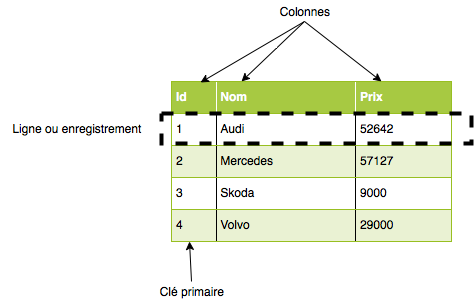

420-3N3-DM Exploitation d'un système de gestion de base de données
==================================================================

Ce cours permet à l'étudiant de s'initier aux bases de données. Il vise à donner à l'étudiant une base suffisante pour
qu'il puisse discuter, comprendre et appliquer les notions de conception et d'utilisation des BD.

### Qu'est-ce qu'une BD?

*Une base de données (anglais database) est un conteneur informatique permettant de stocker - le plus souvent dans un
même lieu - l'intégralité des informations en rapport avec une activité. Une base de données permet de stocker et de
retrouver un ensemble d'informations de plusieurs natures ainsi que les liens qui existent entre les différentes
informations.*

*source*:
[http://fr.wikipedia.org/wiki/Base_de_données](http://fr.wikipedia.org/wiki/Base_de_données)

Dans le cadre de ce cours, nous utiliserons la BD SQLite. Elle a été choisie parce qu'elle est simple, gratuite,
utilisée sur les mobiles
(iphone, android, ...), et qu'elle est facile d'utilisation.

Il existe plusieurs autres BD : PostgreSQL, MySql, Access, SQLServer, Oracle, ...

### Avantages d'une BD vs un fichier texte

Dans le cadre du cours 420-2N2-DM, vous avez développé une application utilisant des fichiers textes. Ces fichiers ont
le désavantage d'être complexes à créer et à gérer. Vous avez utilisé une technique vous forçant à lire le fichier au
complet en mémoire afin de traiter son information. Cette technique montre rapidement ses limites dès que le nombre
d'enregistrements augmente.

Téléchargez ce fichier:
[automobile.sqlite](bds/automobile.sqlite.zip)

et décompressez la (bouton de droite/extraire tout).

Je vous recommande fortement de vous créer un répertoire spécifique pour le cours car vous aurez plusieurs fichiers à
télécharger et à créer.


Installation de sqlite
----------------------

Afin d'ouvrir ce fichier, vous devez avoir sqlite.

Pour installer sqlite sur votre ordi :

- Téléchargez le fichier zip de
  [www.sqlite.org/download.html](http://www.sqlite.org/download.html) à la section Precompiled Binaries for Windows.
  Prenez le fichier `sqlite-tools-win-xxx`

- Dé-zippez le fichier dans un répertoire, et copiez le résultat dans un répertoire que vous retrouverez facilement.

- Dans le cadre du cours, nous n'allons utiliser que l'exécutable `sqlite3.exe`. Vous pouvez le déplacer du répertoire
  sqlite-tools-xxx directement dans un répertoire dans votre `%path%`.

Ouverture à l'aide de l'interface texte
-----------------------------------------

- Démarrez une console: menu démarrer/inscrivez `cmd`

- Déplacez-vous dans le répertoire contenant le fichier
  `automobile.sqlite` (`cd c:\...`) (ou encore, ouvrez un explorateur windows et faire *shift-click de droit/ouvrir une
  fenêtre de commande ici* mais je vous recommande de vous familiariser avec les commandes
  *shell*. Elles sont essentielles à tout bon programmeur.)

- Inscrivez: `sqlite3 automobile.sqlite`

- Inscrivez: `.table` (notez le point `.` avant le mot table) (vous pouvez aussi inscrire `.tables`)

    - Cette commande, spécifique à sqlite, affiche toutes les tables se trouvant dans la base de données. (nous
      reviendrons à la définition d'une table plus tard).

- Inscrivez la commande suivante:
   ```sql
   SELECT *
   FROM Autos;
   ```

- Inscrivez `.q` pour quitter.

Interface graphique SQLiteStudio
--------------------------------

Vous pouvez télécharger SQLiteStudio sur
[SQLiteStudio.pl](http://SQLiteStudio.pl/)

- Décompressez le fichier dans votre répertoire pour BD1. Pour démarrer l'application, double cliquez sur
  `SQLiteStudio.exe`. Choisissez Francais pour la langue.

- Sélectionnez **Base de données/ajout d'une base de données** et allez chercher la BD que vous venez d'installer

- Sélectionnez **Base de données/Connecter la base de données**

- Sélectionnez la table **Autos**, et prenez l'onglet **Données**.

Interface texte de SQLiteStudio
-------------------------------

Sélectionnez **Outils/Ouvrir éditeur SQL**

Sous l'onglet **Requête** inscrivez:

````sql
SELECT *
FROM autos
````

et appuyez sur le triangle bleu (ou F9) pour exécuter la requête.

Vous pouvez quitter SQLiteStudio.


Interface de programmation
--------------------------

Dans un script en Python vous pouvez taper ce code pour aller chercher des infos provenant de votre BD.

````python
import sqlite3 as lite
con = lite.connect('automobile.sqlite')
cur = con.cursor()
cur.execute('select * from Autos')
data = cur.fetchone()
print(data)
````

**J'exécute ce code, et ça me dit que la table Autos n'existe pas.**
Réponse : as-tu copié le fichier `automobile.sqlite` tel qu'indiqué ci-haut? Sinon, la commande `lite.connect` a créé le
fichier, mais il est vide. Tu dois l'effacer et copier le fichier `automobile.sqlite` tel qu'indiqué ci-haut.


Conclusion
----------

Nous venons de voir différentes façons d'accéder le contenu de la BD. Pour les exercices, nous utiliserons l'interface
texte afin de vous familiariser avec les commandes. En tant que programmeurs, nous utiliserons la dernière technique
afin d'intégrer la BD dans notre code, mais les autres techniques seront très utiles afin de vérifier que le code
effectue les bonnes opérations.


Concepts de base
================

Une BD contient des ***tables***, composées de ***champs***. Ces tables sont reliées entre elles par des ***associations***
identifiées à l'aide de champs ayant la caractéristique d'être des ***clés primaires*** ou
***secondaires**.*

Ces entités sont accessibles grâce au langage SQL (Structured Query Langage, prononcé séquel).

La BD est gérée par un logiciel spécialisé appelé le SGBDR (Système de Gestion de BD Relationnel, souvent abrégé à SGBD,
ou en anglais RDBMS).

Dans le cas de SQLite, la BD est entreposée dans un seul fichier. Mais la plupart des autres gestionnaires vont utiliser
des structures plus complexes. C'est ce que nous appellerons le schéma physique.

La représentation du contenu des tables se faisant habituellement de façon « tabulaire », les champs sont aussi
appelés ***colonnes***
*(column)*. Ils représentent un ensemble de valeur (le nom, le prix, ...)

Les champs représentant une «entité» sont regroupés en ***lignes***
*(rows),* souvent appelées ***enregistrements***.

Afin d'identifier de façon unique chaque ligne, nous devons utiliser une ***clé*** *(key).* Cette clé peut être composée
d'un ou de plusieurs champs. Elle est appelée la ***clé primaire***. Elle permet de retrouver sans ambiguïté un
enregistrement donné. Par conséquent les différentes valeurs d'une clef doivent être uniques au sein d'une table. Cette
clé unique est souvent un identificateur numérique séquentiel portant souvent (mais pas forcément) le nom de ***id***.
Cette clé est utilisée pour créer des associations entre les tables à l'aide de ***clés étrangères*** *(foreign keys).*



Nous verrons plus tard comment créer des associations entre les tables.

Une base de données permet habituellement les 4 opérations suivantes :
Création, Lecture, Mise à jour, et Effacement. Vous entendrez souvent le terme anglais **CRUD** (Create, Read, Update,
Delete). Nous verrons comment exécuter ces 4 opérations au courant des prochaines semaines. Nous en avons déjà vu une :
la lecture se fait avec un `SELECT`.


Éléments de base de la syntaxe SQL
----------------------------------

**Clause** : partie optionnelle ou obligatoire d'un ordre SQL (Select, Where, From, Join, ...)

**Prédicat** : expression logique pouvant prendre 3 valeurs : Vrai, Faux, Null.

**Casse** : L'écriture des ordres SQL n'est pas sensible à la casse des caractères. En revanche, l'écriture des valeurs de
données est sensible à la casse.

**Présentation** : SQL est insensible à la césure comme à l'indentation. Vous pouvez donc utiliser le retour de chariot
ou les tabulations pour présenter vos ordres SQL au mieux. Dans le cadre du cours, des points seront associés à la
présentation des requêtes.

**Commentaires** : Vous pouvez soit commencer la ligne par un double tiret `--` pour un commentaire sur une seule ligne
; ou utiliser `/* */` pour les commentaires multilignes.

**Chaîne de caractères** : Toute chaîne de caractères, incluant les dates, doit être entourée d'apostrophe `'` . Pour
représenter une apostrophe dans une chaîne, il faut la doubler `''`.

**Liste** : La virgule est utilisée comme séparateur dans les listes de valeurs.

**Chiffre** : Il ne doit pas y avoir d'espace entre les chiffres composant un nombre.

**Séparateur décimal** : Le séparateur est le point, et non pas la virgule.

**Exposant** : Pour préciser une puissance de 10 dans un réel, il faut utiliser la notation E


Cours sur le SQL en ligne
-------------------------

Vous pouvez vous référer à [http://www.w3schools.com/sql/default.asp](http://www.w3schools.com/sql/default.asp)
pour en savoir plus sur le SQL.


Le SQL de SQLite
================

Je vous donne immédiatement un lien vers la syntaxe complète du SQL utilisé par SQLite. Nous verrons plusieurs de ces
commandes au courant des prochains cours.

[http://www.sqlite.org/lang.html](http://www.w3schools.com/sql/default.asp)

Il est à noter qu'il faut terminer chaque commande par un `;`

Comme indiqué précédemment, les commandes ainsi que les noms de tables et colonnes sont « not case sensitive ». Par
contre, les valeurs utilisées pour identifier de l'information sont « case sensitive ».

Par exemple, la commande

````sql
SELECT *
FROM Autos;
````

peut s'écrire

````sql
seLecT *
fRom AUTOs;
````

Mais le nom de l'auto, dans l'exemple suivant, doit être bien écrit :

````sql
SELECT *
FROM Autos
WHERE Nom = 'Audi';
````

Ce qui veut dire que la commande suivante ne retournera pas le même résultat :

````sql
SELECT *
FROM Autos
WHERE Nom = 'AUDI';
````

Formatage du select dans SQLite
===============================

L'affichage des résultats dans sqlite3 est assez difficile à lire.

Inscrivez la commande suivante:

```sql
SELECT *
FROM autos;
```

```
1|Audi|52642|bleu
2|Mercedes|57127|gris
3|Skoda|9000|gris
4|Volvo|29000|noir
5|Bentley|350000|noir
6|Citroen|21000|blanc
7|Hummer|41400|jaune
8|Volkswagen|21600|bleu
9|Volkswagen|22000|gris
```

Afin d'améliorer cet affichage, vous pouvez utiliser les commandes suivantes:

`.mode column`

et

`.header ON`

Refaite le `SELECT`.

```
Id          Nom         Prix        Couleur
----------  ----------  ----------  ----------
1           Audi        52642       bleu
2           Mercedes    57127       gris
3           Skoda       9000        gris
4           Volvo       29000       noir
5           Bentley     350000      noir
6           Citroen     21000       blanc
7           Hummer      41400       jaune
8           Volkswagen  21600       bleu
9           Volkswagen  22000       gris
```

Beaucoup mieux n'est-ce pas :) ?


Le SELECT
=========

Allons-y avec notre première commande SQL : le `SELECT`.

Il est primordial que vous maîtrisiez cette commande à la perfection. Elle est la base de la construction d'applications
utilisant les bases de données. Vous trouverez peut-être que nous ferons trop d'exercices avec le select, mais
croyez-moi, cette commande doit devenir votre meilleur ami.

Dans le jargon relationnel, nous dirons que le select correspond à l'opération de ***projection,*** car elle permet de «
projeter » les données d'une table dans une autre. En effet, le résultat d'un select est une table temporaire en
mémoire.

Commençons par regarder la syntaxe complète de la commande :

[http://www.sqlite.org/lang_select.html](http://www.w3schools.com/sql/default.asp)

Cette commande peut-être assez intimidante à premier abord, mais allons-y étapes par étapes.

Le langage SQL est de type ***déclaratif***. Cela signifie que nous indiquons ce que nous voulons calculer (le quoi),
mais pas la technique à utiliser pour le calculer (le comment). Jusqu'à maintenant vous avez utilisé uniquement des
langages ***impératifs*** (LARP, Python). Un autre langage déclaratif que vous avez déjà appris est le HTML. Et un autre
exemple de tous les jours : une recherche Google.

Le « comment » est géré par le gestionnaire de BD (SGBD), que nous étudierons plus tard.

Il est donc normal que vous ne soyez pas à l'aise avec le langage aux premiers abords. Oubliez les boucles FOR, les IF,
les variables.

### La sélection de base

La requête la plus simple pouvant être fait sur une table est de demander un « dump » de toutes les colonnes de la
table.

````sql
SELECT *
FROM Autos;
````

Il est aussi possible de spécifier les colonnes que l'on veut afficher

````sql
SELECT Nom
FROM Autos;
SELECT Nom, Prix
FROM Autos;
````

### La clause WHERE

Cette clause permet de préciser quel(s) enregistrement(s) nous désirons extraire.

````sql
SELECT Nom, Prix
FROM Autos
WHERE Prix > 50000;
````

Il est possible d'utiliser des opérateurs logiques dans la condition
(AND, OR, NOT)

````sql
SELECT Nom, Prix
FROM Autos
WHERE (Prix > 50000
    AND Prix < 100000)
   OR Couleur = 'bleu';
````

Si vous utilisez une valeur de texte dans la condition, cette valeur doit être entre guillemets simples (la plupart des
SGBD acceptent aussi le guillemet double)

````sql
SELECT *
FROM Autos
WHERE Nom = 'Audi';
````

Et comme on l'a utilisé déjà, les valeurs numériques n'ont pas besoin de guillemets.

#### Les opérateurs du `WHERE`

    =                égalité
    <>               différent de (on peut aussi utiliser  != )
    > , < , >= , <=
    BETWEEN          une valeur qui est entre les valeurs spécifiées
    LIKE             rechercher pour un pattern (ATTENTION: case incensitive pour ASCII, mais case sensitive pour le reste)
    IN               recherche dans l'ensemble des valeurs spécifiées

Exemples

````sql
SELECT *
FROM Autos
WHERE Prix BETWEEN 20000 AND 30000;

SELECT *
FROM Autos
WHERE Couleur LIKE 'b%';
-- le % est le wildcard

SELECT *
FROM Autos
WHERE Couleur IN ('blanc', 'noir');
````

#### Exercices

Je vous recommande de ne pas regarder la solution avant de l'avoir essayé. Il se peut que vous ayez une solution
différente de la mienne. Si ça donne le même résultat, c'est correct, il n'y pas qu'une façon de le faire. Si c'est
différent, un de nous deux à une erreur...

1. Lister les usagers dont le Nom est Lamothe
   <details>
      <summary>Réponse</summary>   

   ````sql
    SELECT *
    FROM Usagers
    WHERE nom = 'Lamothe';
    ````
    </details>
2. Lister les usagers qui ont plus de 35 ans
   <details>
      <summary>Réponse</summary>   
   
    ````sql
    SELECT *
    FROM usagers
    WHERE age > 35;
    ````
    </details>
3. Lister les usagers dont la ville n'est pas de Drummondville
   <details>
      <summary>Réponse</summary>   

   ````sql
    SELECT *
    FROM usagers
    WHERE ville <> 'Drummondville';
    -- eh oui, l'ensemble vide est une bonne réponse.
    ````
    </details>
4. Lister les usagers qui ont entre 25 et 35 ans (utilisez le AND)
   <details>
      <summary>Réponse</summary>   

   ````sql
    SELECT *
    FROM usagers
    WHERE age > 25
      and age < 35;
    ````
    </details>
5. Lister les usagers qui ont entre 25 et 35 ans (utilisez le BETWEEN)
   <details>
      <summary>Réponse</summary>   

   ````sql
    SELECT *
    FROM usagers
    WHERE age between 25 and 35;
    ````
    </details>
6. Lister les usagers, dont le nom contient un 'a'
   <details>
      <summary>Réponse</summary>   

   ````sql
    SELECT *
    FROM usagers
    WHERE nom like '%a%';
    ````
    </details>
7. Lister seulement le nom et le prénom des usagers qui viennent de Drummondville.
   <details>
      <summary>Réponse</summary>   

   ````sql
    SELECT nom, prenom
    FROM usagers
    WHERE ville = 'Drummondville';
    ````
    </details>
8. Lister les usagers dont le prénom est soit Benoit ou Celine. (utilisez le IN)
   <details>
      <summary>Réponse</summary>   

   ````sql
    SELECT *
    FROM usagers
    WHERE prenom in ('Benoit', 'Celine');
    ````
    </details>
9. Lister les usagers dont le prénom est soit Benoit ou Celine. (utilisez le OR)
   <details>
      <summary>Réponse</summary>   

   ```sql
    SELECT *
    FROM usagers
    WHERE prenom = 'Benoit'
       or prenom = 'Celine';
    ```
    </details>

### La clause DISTINCT

Cette clause permet d'éliminer les doublons dans le résultat d'une requête

````sql
SELECT Nom
FROM Autos; -- (notez que Volkswagen est répété)

SELECT DISTINCT Nom
From Autos;
````

**Important** Si vous avez exécuté la commande dans sqlite3, le résultat a été trié. Mais ne vous fiez **jamais** à
l'ordre dans lequel les enregistrements sont retournés; à moins d'utiliser la clause ORDER BY que nous verrons d'ici 2
minutes. (exemple : si vous avez exécuté la commande dans SQLiteStudio, le résultat n'a pas été trié.)

Pour être éliminée, la ligne au complet doit être un doublon.

````sql
SELECT Nom, Couleur
FROM Autos;

SELECT DISTINCT Nom, Couleur
From Autos;
````

**NOTE** : la valeur NULL est considérée une valeur unique, c.à.d si une voiture aurait eu le Nom mis à Null, cette
valeur aurait été affichée.


### La clause ORDER BY

Il est possible de trier les données par une ou plusieurs colonnes

````sql
SELECT *
FROM Autos
ORDER BY Prix;

SELECT *
FROM Autos
ORDER BY Couleur, Prix;
````

Par défaut, le tri est ascendant. Si on ajoute la clause `asc` le tri sera ascendant; et `desc` le tri sera descendant

````sql
SELECT *
FROM Autos
ORDER BY Couleur, Prix DESC;
````

### Exercices

1. Listez les usagers dont le Nom est Lamothe, et triez-les par leur prénom.
   <details>
      <summary>Réponse</summary>   

    ```sql
    SELECT *
    FROM usagers
    WHERE nom = "Lamothe"
    ORDER BY prenom;
    ```
    </details>

2. Listez tous les prénoms sans répétitions.
   <details>
      <summary>Réponse</summary>   

    ```sql
    SELECT DISTINCT prenom
    FROM usagers;
    ```
    </details>

3. Listez les usagers dont le nom ne contient pas un 'a', triés par leur âge.
   <details>
      <summary>Réponse</summary>   

    ```sql
    SELECT *
    FROM usagers
    WHERE nom NOT LIKE "%a%"
    ORDER BY age;
    ```
    </details>

------------------------------------------------------------------------

Notes écrites par Benoit Desrosiers, modifiées par Denis Rinfret.
