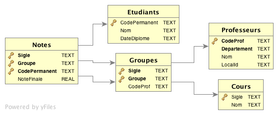
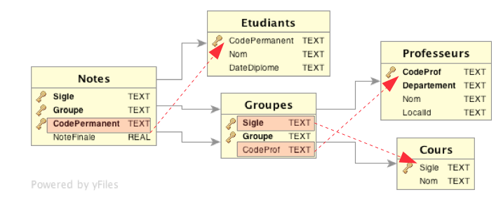
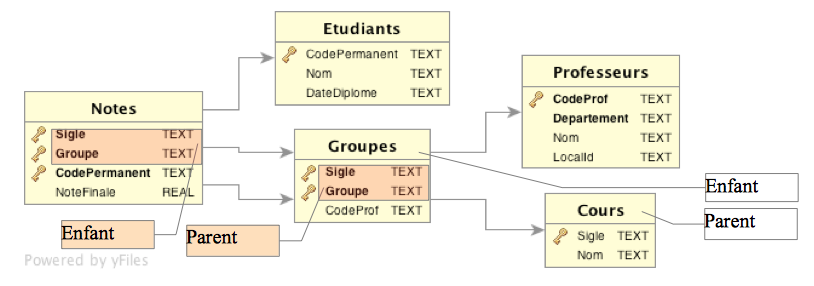

Les associations
================

Afin d'étudier ces nouveaux concepts, nous allons utiliser une nouvelle base de données :
[etudiants.sqlite](bds/etudiants.sqlite.zip)

Cette BD est composée de 5 tables :

````sql
CREATE TABLE Etudiants
(
    CodePermanent TEXT PRIMARY KEY,
    Nom           TEXT,
    DateDiplome   TEXT
);

CREATE TABLE Groupes
(
    Sigle    TEXT NOT NULL,
    Groupe   TEXT NOT NULL,
    CodeProf TEXT,
    PRIMARY KEY (Sigle, Groupe),
    FOREIGN KEY (CodeProf) REFERENCES Professeurs (CodeProf),
    FOREIGN KEY (Sigle) REFERENCES Cours (Sigle)
        ON DELETE RESTRICT
        ON UPDATE CASCADE
);

CREATE TABLE Notes
(
    Sigle         TEXT NOT NULL,
    Groupe        TEXT NOT NULL,
    CodePermanent TEXT NOT NULL,
    NoteFinale    REAL,
    PRIMARY KEY (Sigle, Groupe, CodePermanent),
    FOREIGN KEY (CodePermanent) REFERENCES Etudiants (CodePermanent),
    FOREIGN KEY (Sigle, Groupe) REFERENCES Groupes (Sigle, Groupe)
);

CREATE TABLE Professeurs
(
    CodeProf    TEXT NOT NULL,
    Departement TEXT NOT NULL,
    Nom         TEXT,
    LocalId     TEXT,
    PRIMARY KEY (CodeProf)
);

CREATE TABLE Cours
(
    Sigle TEXT PRIMARY KEY,
    Nom   TEXT
);
````

Nous allons maintenant étudier de nouvelles contraintes et voir comment gérer ces tables.


Diagramme entités-associations (DEA)
---------------------------------

Nous verrons plus tard comment réaliser un DEA, mais le voici pour cette BD.




Clé primaire vs Clé étrangère
-----------------------------

### Le problème

Un cours se donne à plusieurs groupes. Dans la table `Groupes`, j'indiquerai le nom du cours en créant la table de cette
façon :

```sql
CREATE TABLE Groupes
(
    Sigle      TEXT NOT NULL,
    Groupe     TEXT NOT NULL,
    NomDuCours TEXT,
    CodeProf   TEXT
);
```

J'obtiendrai une table ressemblant à :

```
Sigle       Groupe      NomDuCours            CodeProf
----------  ----------  –---------           ----------
420BD1      001         Base de Donnée 1        11
420BD1      002         Base de Donnée 1        11
420CN1      001         Conception Web 1        11
420PRA      001         Prog 1                  22
420DC1      001         Documentation 1         33
```

Notez que `'Base de Donnée 1'` se répète 2 fois, car il y a 2 groupes pour ce cours.

Il serait difficile de changer le nom du cours, car il devrait être changé dans tous les enregistrements qui le
contiennent. Il y aurait inévitablement des cas ou le nom aura été changé dans un enregistrement, mais pas dans un
autre (on appelle cela un bug).

### La solution

En envoyant le nom du cours dans une autre table, et en ne référant qu'à son `Sigle` (la clé primaire, qui elle ne
changera pas), ce nom n'existera qu'à une seule place dans la BD et est donc facile à changer.

Afin d'utiliser cette technique, nous devons créer une référence à la clé primaire de la table `Cours` (le Sigle) dans la
table Groupes.

```sql
CREATE TABLE Groupes
(
    Sigle    TEXT NOT NULL,
    Groupe   TEXT NOT NULL,
    CodeProf TEXT,
    PRIMARY KEY (Sigle, Groupe),
    FOREIGN KEY (CodeProf) REFERENCES Professeurs (CodeProf)
        ON DELETE RESTRICT
        ON UPDATE CASCADE,
    FOREIGN KEY (Sigle) REFERENCES Cours (Sigle)
        ON DELETE RESTRICT
        ON UPDATE CASCADE
);
```

Cette technique est aussi la raison pour laquelle seul le `CodePermanent` de l'étudiant apparaît dans la table `Notes`
(une note est pour un étudiant) ; que le `CodeProf` apparaît dans la table `Groupes` (un cours est donné par un prof) ; ou
encore que le `Sigle` apparaît dans la table `Groupes` (un groupe suit un cours).



#### Clé étrangère

Cette référence s'appelle une **clé étrangère** (**foreign key = fk**).

Si nous reprenons l'association entre `Groupes` et `Cours`, c'est le champ `Sigle` qui fait ce lien.

```sql
CREATE TABLE Groupes
(
    Sigle    TEXT NOT NULL,
    Groupe   TEXT NOT NULL,
    CodeProf TEXT,
    PRIMARY KEY (Sigle, Groupe),
    FOREIGN KEY (CodeProf) REFERENCES Professeurs (CodeProf),
    FOREIGN KEY (Sigle) REFERENCES Cours (Sigle)
        ON DELETE RESTRICT
        ON UPDATE CASCADE
);
```

Une fois cette association créée, on doit s'assurer que pour toute valeur de `Sigle` trouvée dans la table `Groupes`, il
y aura un enregistrement dans la table `Cours`. Cette règle est imposée par la contrainte *Foreign Key*. Cette
contrainte fera en sorte qu'il est impossible de faire une entrée dans la table `Groupes` si le `Sigle` ne se trouve pas
dans la table
`Cours`. De plus, elle indique quoi faire dans le cas ou je change la valeur du `Sigle` dans la table `Cours`, ou que
j'efface un enregistrement dans la table `Cours` alors que des enregistrements se servent de cette valeur dans la
table `Groupes`. Nous verrons toutes ces règles en détail dans ce cours.

Nous verrons la semaine prochaine les règles et techniques à suivre afin de bien séparer les tables.


Les clés étrangères
-------------------

### Important : Activation des clés étrangères

Par défaut, la validation des clés étrangères n'est pas activée dans SQLite. Il faut l'activer avec la commande
suivante :

```sql
PRAGMA foreign_keys = ON;
```

Exemple
-------

```sql
-- sqlite3 etudiants.sqlite

-- Efface l'enregistrement par erreur
DELETE
FROM Groupes
WHERE Sigle = 'asdf';

-- Cet insert devrait passer car les foreign key ne sont pas activées
INSERT INTO Groupes
VALUES ('asdf', '001', '21');

-- Efface l'enregistrement  en erreur
DELETE
FROM Groupes
WHERE Sigle = 'asdf';

-- Active le PRAGMA
PRAGMA foreign_keys= ON;

-- Cette fois-ci, ca devrait planter.
INSERT INTO Groupes
VALUES ('asdf', '001', 21);
```

Création des clés étrangères
----------------------------

Commençons par un peu de terminologie :

- table **Parente** : la table à laquelle la clause `FOREIGN KEY` réfère

- table **Enfant** : la table dans laquelle la clause est créée

- clé **Parente** : la colonne (ou les colonnes) de la table parente. Habituellement, c'est la clé primaire

- clé **Enfant** : la colonne de la table enfant sur laquelle la contrainte s'applique.

[http://www.sqlite.org/foreignkeys.html](http://www.sqlite.org/foreignkeys.html)

```sql
CREATE TABLE Groupes
(
    Sigle    TEXT NOT NULL,
    Groupe   TEXT NOT NULL,
    CodeProf TEXT,
    PRIMARY KEY (Sigle, Groupe),
    FOREIGN KEY (CodeProf) REFERENCES Professeurs (CodeProf),
    FOREIGN KEY (Sigle) REFERENCES Cours (Sigle) ON DELETE RESTRICT ON UPDATE CASCADE
);

CREATE TABLE Notes
(
    Sigle         TEXT NOT NULL,
    Groupe        TEXT NOT NULL,
    CodePermanent TEXT NOT NULL,
    NoteFinale    REAL,
    PRIMARY KEY (Sigle, Groupe, CodePermanent),
    FOREIGN KEY (CodePermanent) REFERENCES Etudiants (CodePermanent),
    FOREIGN KEY (Sigle, Groupe) REFERENCES Groupes (Sigle, Groupe)
);
```



Nous venons de voir des exemples de foreign key dans le DDL. (data definition langage = l'interface texte).

La syntaxe fait partie de la commande `CREATE TABLE` :

```txt
CREATE TABLE TableEnfant
...
FOREIGN KEY (clé enfant) REFERENCES TableParent (clé parent)
```

Il y a 2 clauses additionnelles que nous utiliserons : `ON DELETE`, et `ON UPDATE`. Pour une description complète, vous
pouvez vous référer à la section 4.3 de [http://www.sqlite.org/foreignkeys.html](http://www.sqlite.org/foreignkeys.html)

Ces clauses indiquent quoi faire lorsque la clé est effacée ou modifiée dans la table parente. Il y a 5 valeurs
possibles : `NO ACTION`, `RESTRICT`, `SET NULL`, `SET DEFAULT`, `CASCADE`.

`NO ACTION` est presque équivalent à `RESTRICT`. La différence : `NO ACTION` valide à la fin de la transaction, alors
que `RESTRICT` est immédiat.

Habituellement, les valeurs utilisées sont : `ON DELETE RESTRICT ON UPDATE CASCADE`.

De cette façon, il est impossible d'effacer un enregistrement dans la table parent s'il reste des enregistrements dans
la table enfant et les changements faits dans la table parent seront aussi fait dans la table enfant.

### Création dans SqliteStudio

Dans SqliteStudio, pour créer une foreign_key vous avez 2 choix :

1. lors de la création/édition d'une colonne, vous pouvez sélectionner *Foreign key*, et *Configure*. Vous pouvez alors
   choisir la table et **LA** colonne de la table parente, ainsi que l'action à faire sur l'update et le delete.

2. Dans la section *Table Constraints* en bas de l'écran d'édition de la table, vous pouvez ajouter une contrainte en
   appuyant sur le + en vert, sélectionner *Foreign key* pour le type, appuyer sur *Configure*, choisir la table et
   faire l'association **DES** colonnes, et choisir l'update et delete.

Index, Deferred, et effet sur le Drop table
-------------------------------------------

L'utilisation des *foreign keys* se fait habituellement en pointant la table enfant vers la clé primaire de la table
parent. Mais il est possible d'utiliser n'importe quel champ de la table parent. Dans ce cas, il faut faudra créer des
index supplémentaires. Nous ne le verrons pas dans le cadre du cours pour l'instant, mais vous pouvez lire la section 3
de `http://www.sqlite.org/foreignkeys.html` pour plus d'information.

Il est aussi possible de configurer la foreign key pour ne pas générer une erreur avant la fin de la transaction en cas
de violation de la contrainte. Cela s'appelle une *deferred fk*. Vous pouvez lire la section 4.2 pour plus de détails.

Et finalement, tel que mentionné lors des explications sur Drop table, le fait d'avoir un fk peut faire en sorte que le
système vous empêchera d'effacer une table si cela viole une contrainte de fk. Voir la section 5 pour plus de détails.


Exercices sur les clés étrangères
---------------------------------

1. Est-il plus simple d'utiliser une clé naturelle ou artificielle lors de la création de FK ?
   <details>
      <summary>Réponse</summary>   

    - Ça dépend ! Si la clé naturelle est contenue dans un seul champ, alors c'est aussi simple de prendre l'une que
      l'autre.
    - Par contre, si la clé naturelle est composée (plusieurs champs), alors la définition de la FK sera plus complexe.
    - Mais il est plus simple de suivre les associations entre les tables en suivant une clé naturelle qu'une clé
      artificielle.
   </details>

#### Pour les questions suivantes, créez une nouvelle BD appelée `semaine3.sqlite`

1. Créez une table pour les usagers permettant d'entreposer leur nom (et leur id) ainsi qu'une table pour les
   automobiles permettant de connaitre le modèle.

   <details>
   <summary>Réponse</summary>   

   ```sql
   CREATE TABLE Usagers
   (
       id  INTEGER NOT NULL PRIMARY KEY,
       nom TEXT    NOT NULL
   );
   
   CREATE TABLE Automobiles
   (
       id     INTEGER NOT NULL PRIMARY KEY,
       modele TEXT    NOT NULL
   );
   ```
   </details>

2. Modifiez la commande précédente afin de permettre d'indiquer qu'une personne a plusieurs voitures
   <details>
      <summary>Réponse</summary>   

   ```sql
   DROP TABLE Automobiles;
   
   CREATE TABLE Automobiles
   (
       id           INTEGER NOT NULL PRIMARY KEY,
       modele       TEXT    NOT NULL,
       proprietaire INTEGER,
       FOREIGN KEY (proprietaire) REFERENCES Usagers (id)
           ON DELETE RESTRICT
           ON UPDATE CASCADE
   );
   ```
   </details>

3. Quelle est la commande pour vérifier que les tables ont été crées ?
   <details>
      <summary>Réponse</summary>   

   ````
   .schema
   ````
   </details>

4. Insérez les enregistrements suivants :
    - Bob a une Camaro
    - Roger a une Corvette, et une Ferrari
   <details>
      <summary>Réponse</summary>   

   ```sql
   INSERT INTO Usagers
   VALUES (1, 'Bob');
   INSERT INTO Usagers
   VALUES (2, 'Roger');
   INSERT INTO Automobiles
   VALUES (1, 'Camaro', 1);
   INSERT INTO Automobiles
   VALUES (2, 'Corvette', 2);
   INSERT INTO Automobiles
   VALUES (3, 'Ferrari', 2);
   ```
   </details>

5. Qu'arrive-t-il si j'essaie d'exécuter la commande suivante :
   <details>
      <summary>Réponse</summary>   

   ```sql
   INSERT INTO Automobiles VALUES (4,'Soul',3);
   ```
    - Si le `pragma foreign_keys` est à `OFF`, l'ajout se fera sans problèmes.
    - S'il est à `ON`, vous aurez une erreur. Pourquoi ?
    - le 3 dans l'insert réfère à l'id d'un usager. Il n'y a pas d'usager avec cet ID.
    - Il est recommandé de le mettre à ON.
   </details>

6. Maintenant, si je veux indiquer qu'une voiture appartient à plusieurs automobilistes, et qu'un automobiliste à
   plusieurs voitures, qu'est-ce que je devrai modifier ?
   <details>
      <summary>Réponse</summary>   

    - une association plusieurs à plusieurs
   </details>

Les associations « plusieurs à plusieurs »
---------------------------------------

Revenons à la question posée dans la leçon précédente : comment faire pour indiquer qu'un automobiliste peut avoir
plusieurs voitures, et qu'une voiture appartient à plusieurs personnes ?

Nous appellons ce genre d'association « une association plusieurs à plusieurs » (many to many).

Voyons le problème plus en détails :

- Si j'ajoute, comme nous l'avons fait, l'id de l'usager (le champ proprietaire) dans la table `Automobiles`, alors une
  voiture ne peut appartenir qu'à un seul usager.

- On pourrait mettre l'id de l'automobile dans la table usager, de cette façon une voiture pourrait apparaître dans
  plusieurs enregistrements de la table usagers, mais un usager ne pourrait avoir qu'une seule voiture.

**La solution** : créer une table intermédiaire ne contenant que les clés étrangères.

```sql
CREATE TABLE Usagers_Automobiles
(
    idAutomobile integer not null,
    idUsager     integer not null,
    PRIMARY KEY (idAutomobile, idUsager),
    FOREIGN KEY (idAutomobile) REFERENCES Automobiles (id)
        ON DELETE RESTRICT ON UPDATE CASCADE,
    FOREIGN KEY (idUsager) REFERENCES Usagers (id)
        ON DELETE RESTRICT ON UPDATE CASCADE
);
```

On a donc plus besoin d'avoir le propriétaire dans la table `Automobiles`.

On peut maintenant associer autant de voitures à autant d'usagers que l'on veut.


Exercices
---------

1. Enlevez la colonne propriétaire de la table Automobiles.

    - Le plus simple est de 'dropper' la table et la recréer.
    - SQLite ne tolère pas bien les changements de schéma.
    - D'autres bases de données permettent la commande ALTER TABLE, mais nous ne la verrons pas.

<details>
<summary>Réponse</summary>   

```sql
   DROP TABLE Automobiles;
CREATE TABLE Automobiles
(
    id     INTEGER NOT NULL PRIMARY KEY,
    modele TEXT    NOT NULL
);
```

- Et réinsérez les voitures.
   </details>


2. Insérez les enregistrements dans `Usagers_Automobiles` afin de créer les associations suivantes :
    - Bob a une Camaro et une Corvette
    - Roger a une Camaro et une Ferrari

<details>
<summary>Réponse</summary>   

```sql
   INSERT INTO Usagers_Automobiles
   VALUES (1, 1);
INSERT INTO Usagers_Automobiles
VALUES (2, 1);
INSERT INTO Usagers_Automobiles
VALUES (1, 2);
INSERT INTO Usagers_Automobiles
VALUES (3, 2);
```

</details>


Les jointures
-------------

Maintenant que nous avons de l'information séparée sur plusieurs tables, comment faire pour mettre tout ça ensemble.

La solution : **les jointures de tables.**

Une jointure est le fait d'unir l'information de 2 tables pour en générer une troisième (n'oubliez pas que le résultat
du `Select` est une table (en mémoire)).

Reprenons notre BD `Etudiants`.


### Alias de nom de table

Étant donné que nous allons avoir un `Select` avec plusieurs tables, il est plus que possible que ces tables aient des
champs ayant le même nom. Afin de pouvoir différencier la provenance d'un champ, nous devons ajouter un préfixe afin de
connaître la table d'où provient le champ. Ce préfixe est soit le nom de la table, soit un alias qui représente cette
table.

Les cas d'utilisation fréquents pour un alias de table :

- dans un cas d'ambiguïté
- un nom d'attribut est utilisé dans plus d'une table
- une table apparaît deux fois dans une requête
- nom de table plus court
- nom de table plus significatif

Exemple de jointure et d'alias de nom de table :

```sql
SELECT g.Sigle, p.Nom
FROM Groupes g,
     Professeurs p
WHERE g.CodeProf = p.CodeProf
ORDER BY Sigle;
```

`g` est l'alias pour la table `Groupes`, et `p` est l'alias pour la table `Professeurs`.


Les jointures
-------------

Il existe plusieurs types de jointure. Nous verrons certains exemples pour chacune d'elles, mais je vous recommande
d'aller lire [http://www.w3resource.com/sql/joins/sql-joins.php](http://www.sqlite.org/foreignkeys.html) pour plus de
détails.

#### Equi Join et Non Equi Join

On appele une jointure un *Equi Join* lorsque le seul opérateur de comparaison est l'égalité =.

La requête donnée en exemple ci-haut est un equi join.

Toute autre requête est un Non Equi Join. (`<`, `>`, `between`, ...).

Cette terminologie est donc une catégorisation plutôt qu'une syntaxe particulière.

#### Jointure Interne (INNER JOIN)

Le `INNER JOIN` combine les valeurs des colonnes de 2 tables en se basant sur la condition de la clause `WHERE`. La
requête compare chaque enregistrement de la première table avec chaque enregistrement de la 2e table afin de trouver
tous ceux qui satisfont la condition. Quand la condition est satisfaite, les champs des 2 tables sont combinés afin de
créer un nouvel enregistrement.

Ce type de jointure est le plus courant.

````
SELECT ...
FROM tableGauche
INNER JOIN tableDroite
ON conditionDeJointure
-- NOTE: le mot INNER est optionnel
````

Exemple :

```sql
SELECT e.Nom, n.NoteFinale
FROM Etudiants e
         INNER JOIN Notes n
                    ON e.CodePermanent = n.CodePermanent
                        AND n.NoteFinale > 70
                        AND n.Sigle = '420BD1';
```

Notez que la condition dans le ON pourrait aussi être spécifiée dans un WHERE

```sql
SELECT e.Nom, n.NoteFinale
FROM Etudiants e
         INNER JOIN Notes n
WHERE e.CodePermanent = n.CodePermanent
  AND n.NoteFinale > 70
  AND n.Sigle = '420BD1';
```

La meilleure forme utilise un mélange de `ON` et `WHERE`. Les conditions réliées directement à la jointure devrait être
placée dans le `ON`, et les autres dans le `WHERE`.

```sql
SELECT e.Nom, n.NoteFinale
FROM Etudiants e
         INNER JOIN Notes n ON e.CodePermanent = n.CodePermanent
WHERE n.NoteFinale > 70
  AND n.Sigle = '420BD1';
```

Il n'y a pas de différence entre l'utilisation de `INNER JOIN` avec un `ON` ou le `WHERE`. Vous trouverez plusieurs
argumentations à ce sujet. La plupart indiquent que la requête sera plus rapide avec le `ON`, mais un bon optimiseur de
requêtes ne fera pas de différence. Mais dans le cadre du cours, il est recommandé d'utiliser la syntaxe `ON` afin de
standardiser les requêtes. En effet, nous verrons que le `WHERE` ne peut être utilisé pour d'autres formes de jointures.

#### Jointure naturelle (NATURAL JOIN)

La jointure naturelle est une sous-classe de Equi Join. L'opérateur `NATURAL JOIN` permet d'éviter de préciser les
colonnes concernées par la jointure ; le compilateur SQL va rechercher dans les 2 tables, les colonnes dont le nom est
identique. Bien entendu, le type de données doit être le même.

Pour ce faire, la requête doit avoir les caractéristiques suivantes :

- Les tables associées doivent avoir un ou plusieurs champs ayant le même nom.
- Ces colonnes doivent être de types compatibles
- Il n'y a pas de clause `ON`.

Exemple :

```sql
SELECT e.Nom, n.NoteFinale
FROM Etudiants e
         NATURAL JOIN Notes n;
```

Ce type de jointure est rarement utilisée, car le résultat peut changer si on change la structure des tables jointes
(encore ici, ne pas faire confiance aux valeurs par défaut... toujours être explicite).

#### Produit Cartésien (CROSS JOINT)

Un produit entre deux tables représente le couplage de chacun des champs d'une table avec chacun des champs de l'autre
table. On se retrouve avec un produit cartésien.

```sql
SELECT Nom, Sigle
FROM Professeurs,
     Groupes;
-- ou
SELECT Nom, Sigle
FROM Professeurs
         CROSS JOIN Groupes;
```

**NOTE** : Ce produit peut retourner des lignes plusieurs fois. Pour éliminer les duplications, utiliser la
clause `DISTINCT`.

De plus, cette jointure peut retourner beaucoup d'information. Elle est donc rarement utilisée, et à éviter autant que
possible. Le mot *produit cartésien* devrait vous donner des frissons dans le dos...

Un exemple où cette jointure peut être utile :

- J'ai une table contenant les étudiants d'un cours et une table contenant les travaux pour ce cours.
- Je désire générer une liste contenant le nom de l'étudiant associé à chacun des travaux (pour en faire la correction).

Nous continuerons d'étudier les autres types de jointures à la prochaine leçon.

 
