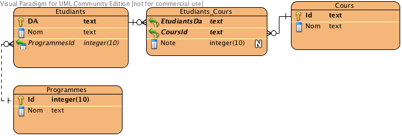

# `SELECT` imbriqué

Un **select imbriqué**, est un select à l'intérieur d'un autre select. Sa durée
de vie correspond au temps d'exécution de l'instruction dans laquelle il est
imbriqué.

Si le select imbriqué retourne une ligne d'une seule valeur, on parle alors
de **valeur scalaire**. Une valeur scalaire peut remplacer toute colonne ou
constante d'une commande.

Si le select imbriqué retourne plus d'une ligne, mais une seule colonne, il peut
remplacer une liste de valeurs. Nous l'utiliserons avec la clause **in**.

Si le select imbriqué retourne plus d'une ligne et plus d'une colonne, il peut
être utilisé avec **exists**.

Sous requête
------------

Une **sous-requête** (subquery) est un select imbriqué dans la clause WHERE afin
de servir de critère de sélection.

Les sous-requêtes peuvent être construites avec les opérateurs suivants :

- `in` (valeur scalaire)
- opérateurs relationnels (valeur scalaire)
- `exists`, `not exists` (table)
- `any`, `all` (valeur scalaire)

Il existe aussi d'autres opérateurs que nous ne verrons pas dans le cadre de ce
cours.

Exemples
--------------

Nous utiliserons la bd
[EtudiantProgramme.sqlite](bds/EtudiantProgramme.sqlite.zip)
que vous avez déjà.



Lister le code des étudiants du cours `420BD1` ainsi que leur note pour ce
cours, suivi de la meilleure note pour ce cours.

````sql
SELECT EtudiantsDa,
       Note,
       (SELECT MAX(Note)
        FROM Etudiants_Cours
        WHERE CoursId = '420BD1')
FROM Etudiants_Cours
WHERE CoursId = '420BD1';
````

### `IN`

Lister tous les étudiants ayant suivi le cours `420CN1`.

````sql
SELECT nom
FROM Etudiants
WHERE DA IN (SELECT DISTINCT EtudiantsDa
             FROM Etudiants_cours
             WHERE CoursId = '420CN1');
````

**Note 1 :** Le select imbriqué utilisé dans une clause `IN` doit retourner une
seule colonne. Voir plus de détails sur
[https://www.sqlite.org/lang_expr.html](https://www.sqlite.org/lang_expr.html)

**Note 2** : non seulement il aurait aussi été possible de faire cette requête
avec une simple jointure, il est fortement recommandé d'utiliser une jointure.

````sql
SELECT nom
FROM Etudiants e
         inner join Etudiants_cours ec on e.da = ec.EtudiantsDa
WHERE CoursId = '420CN1';
````

### Opérateur relationnel

Lister les étudiants qui ont une note supérieure à la moyenne dans un cours.

```sql
SELECT e.Nom, n.CoursId, n.Note
FROM Etudiants e
         INNER JOIN Etudiants_Cours n ON e.DA = n.EtudiantsDa
WHERE Note > (SELECT avg(Note)
              FROM Etudiants_Cours
              WHERE CoursId = n.CoursId
              GROUP BY CoursId);
```

**Note 1** : ici, il serait impossible de réaliser cette requête avec un simple
`join`.

**Note 2** : la valeur retournée par la sous-requête doit être une valeur
scalaire, et de plus, le `select` de la sous-requête doit retourner une seule
ligne.
Voir [https://www.sqlite.org/lang_expr.html](https://www.sqlite.org/lang_expr.html)

**Note 3** : il est possible d'utiliser des tables du `select` principal dans la
sous-requête (la table `n` dans l'exemple). On appelle cela des requêtes
**corrélées**. Il est important de comprendre que la sous-requête sera exécutée
pour chacun des enregistrements de la requête principale. Elle peut donc
ralentir considérablement le système, et devrait être utilisée avec parcimonie
et être remplacée si possible par une requête avec jointure.

#### Avec `WITH` et jointure, sans sous-requête corrélée

```sql
WITH moyenne_par_cours AS (SELECT CoursId, avg(Note) AS moyenne
                           FROM Etudiants_Cours
                           GROUP BY CoursId)
SELECT e.Nom, ec.CoursId, ec.Note
FROM Etudiants e
         INNER JOIN Etudiants_Cours ec ON e.DA = ec.EtudiantsDa
         INNER JOIN moyenne_par_cours m ON ec.CoursId = m.CoursId
WHERE Note > moyenne;
```

### `Exists`

Lister les cours où il y a des étudiants qui ont une moyenne supérieure à 90
pour ce cours. (*NOTE DR 2021* Question un peu "piège" : un étudiant peut
prendre un cours plus qu'une fois, donc il est possible de prendre la moyenne
des notes des étudiants pour chaque cours ; il serait peut-être préférable
d'utiliser `MAX`
pour trouver la meilleure note de chaque étudiant pour chaque cours)

```sql
SELECT c.Nom
FROM Cours c
WHERE exists(SELECT avg(note)
             FROM Etudiants_Cours e
             WHERE c.Id = e.CoursId
             GROUP BY EtudiantsDa
             HAVING avg(note) > 90);
```

**Note 1** : La jointure entre les deux selects est requise. Une ligne du select
extérieur est sélectionnée si elle est couplée à au moins une ligne du select
imbriqué grâce à une jointure contenue dans le select imbriqué

#### Avec `WITH` et jointure, sans sous-requête corrélée ni `EXISTS`

```sql
WITH moyenne_par_cours AS (SELECT DISTINCT CoursId
                           FROM Etudiants_Cours
                           GROUP BY CoursId, EtudiantsDa
                           HAVING avg(note) > 90)
SELECT c.Nom
FROM Cours c
         INNER JOIN moyenne_par_cours m ON c.Id = m.CoursId;
```

#### Avec `WITH` et `IN`, sans sous-requête corrélée ni `EXISTS`

```sql
WITH moyenne_par_cours AS (SELECT DISTINCT CoursId
                           FROM Etudiants_Cours
                           GROUP BY CoursId, EtudiantsDa
                           HAVING avg(note) > 90)
SELECT c.Nom
FROM Cours c
WHERE c.Id IN moyenne_par_cours;
```

**Note 2** : Si on veut les étudiants qui n'ont pas une seule note > 90, on peut
simplement mettre `NOT EXISTS`

```sql
SELECT c.Nom
FROM Cours c
WHERE not exists(SELECT avg(note)
                 FROM Etudiants_Cours e
                 WHERE c.Id = e.CoursId
                 GROUP BY EtudiantsDa
                 HAVING avg(note) > 90);
```

#### Avec `WITH` et jointure, sans sous-requête corrélée ni `NOT EXISTS`

```sql
WITH moyenne_par_cours AS (SELECT DISTINCT CoursId
                           FROM Etudiants_Cours
                           GROUP BY CoursId, EtudiantsDa
                           HAVING avg(note) > 90)
SELECT c.Nom
FROM Cours c
         LEFT JOIN moyenne_par_cours m ON c.Id = m.CoursId
WHERE m.CoursId IS NULL;
```

#### Avec `WITH` et `NOT IN`, sans sous-requête corrélée ni `NOT EXISTS`

```sql
WITH moyenne_par_cours AS (SELECT DISTINCT CoursId
                           FROM Etudiants_Cours
                           GROUP BY CoursId, EtudiantsDa
                           HAVING avg(note) > 90)
SELECT c.Nom
FROM Cours c
WHERE c.Id NOT IN moyenne_par_cours;
```

**Attention avec `NOT IN`** : il n'est pas conseillé d'utiliser `NOT IN`
parce qu'il y aura des problèmes si la sous-requête contient des valeurs nulles.

````sql
select *
from Cours
where Id in ('420BD1', null);
````

````sql
select *
from Cours
where Id not in ('420BD1', null);
````

### `ANY`, `ALL`

Cette clause n'est pas implantée dans SQLite. Elle permettrait de résoudre ce
genre de questions : lister les étudiants du cours 420CN1 qui ont une note
supérieure à la meilleure note du cours 420BD1.

Ce code ne fonctionnera pas dans SQLite.

```sql
SELECT EtudiantsDa, Note
FROM Etudiants_Cours
WHERE CoursId = '420CN1'
  AND Note > ALL ( SELECT Note
    FROM Etudiants_Cours
    WHERE CoursId = '420BD1' );
```

Mais, parfois, un opérateur `ALL` peut être remplacé par un Max ou un Min
(mais pas tout le temps) :

```sql
SELECT EtudiantsDa, Note
FROM Etudiants_Cours
WHERE CoursId = '420CN1'
  AND Note > (SELECT MAX(Note)
              FROM Etudiants_Cours
              WHERE CoursId = '420BD1'
              GROUP BY CoursId);
```

## Exercices

Utilisez la BD
[EtudiantProgramme.sqlite](bds/EtudiantProgramme.sqlite.zip)


### Ex 1

Lister le nom, le DA et la note de tous les étudiants du cours 420CN1, suivit de
la moyenne de tous les étudiants pour ce cours.

Ex :

```
Michel Allard|ALLM111111|77|79.0
Paul Paul|PAUP222222|75|79.0
Gino Chouinard|CHOG333333|76|79.0
Pierre Tanguay|TANP444444|99|79.0
Sylvie Deshaies|DESS555555|78|79.0
Patricia Fortin|FORP666666|69|79.0
```

<details>
    <summary>Réponse</summary>

```sql
SELECT e.Nom,
       n.EtudiantsDa,
       Note,
       (SELECT AVG(Note)
        FROM Etudiants_Cours
        WHERE CoursId = '420CN1'
        GROUP BY CoursId)
FROM Etudiants e
         INNER JOIN Etudiants_Cours n ON e.DA = n.EtudiantsDa
WHERE CoursId = '420CN1'
;
```

</details>

### Ex 2

Lister le nom des étudiants, les cours qu'ils suivent, la note de chaque cours,
ainsi que la moyenne générale de cet étudiant (truc : pour avoir la moyenne
afficher sur chaque ligne, il faut un select qui la calcule et ensuite faire un
join avec le select principal)

ex :

```
Michel Allard|420BD1|87|82.0
Michel Allard|420CN1|77|82.0
```

<details>
    <summary>Réponse</summary>  

```sql
SELECT e.Nom, n.CoursId, n.Note, n2.moyenne
FROM Etudiants e
         INNER JOIN Etudiants_Cours n ON e.DA = n.EtudiantsDa
         INNER JOIN (SELECT EtudiantsDa, AVG(Note) as moyenne
                     FROM Etudiants_Cours
                     GROUP BY EtudiantsDa) n2
                    ON n2.EtudiantsDa = n.EtudiantsDa;
```

```sql
WITH n2 AS (SELECT EtudiantsDa, AVG(Note) as moyenne
            FROM Etudiants_Cours
            GROUP BY EtudiantsDa)
SELECT e.Nom, n.CoursId, n.Note, n2.moyenne
FROM Etudiants e
         INNER JOIN Etudiants_Cours n ON e.DA = n.EtudiantsDa
         INNER JOIN n2 ON n2.EtudiantsDa = n.EtudiantsDa;
```

</details>

### Ex 3

Lister tous les étudiants qui ont au moins une note > 90

Il y a 4 façons de résoudre ce problème. Les trouverez-vous toutes ?

Le résultat est : Pierre Tanguay

Pour la solution 1, utilisez un select imbriqué sur un `EXISTS`.

Truc : est-ce qu'il *existe* une note > 90 pour cet étudiant ?

<details>
    <summary>Réponse</summary>  

```sql
SELECT e.Nom
FROM Etudiants e
WHERE EXISTS(SELECT *
             FROM Etudiants_Cours n
             WHERE e.DA = n.EtudiantsDa
               AND Note > 90);
```

</details>

Pour la solution 2, utilisez un select imbriqué sur un opérateur relationnel.

Truc : est-ce qu'il y a un compte supérieur à 0 pour le compte du nombre de
notes supérieur à 90 pour cet étudiant ?

<details>
    <summary>Réponse</summary>  

```sql
SELECT e.Nom
FROM Etudiants e
WHERE 0 < (SELECT COUNT(*)
           FROM Etudiants_Cours n
           WHERE e.DA = n.EtudiantsDa
             AND Note > 90);
```

</details>

Pour la solution 3, utilisez un select imbriqué sur un `IN`.

<details>
    <summary>Réponse</summary>  

```sql
SELECT e.Nom
FROM Etudiants e
WHERE DA IN (SELECT DISTINCT EtudiantsDa
             FROM Etudiants_Cours
             WHERE Note > 90);
```

</details>

Pour la solution 4, utilisez un simple `join` (meilleure solution).

<details>
    <summary>Réponse</summary>  

```sql
SELECT DISTINCT e.Nom
FROM Etudiants e
         INNER JOIN Etudiants_Cours n ON e.DA = n.EtudiantsDa
WHERE n.note > 90;
```

</details>

### Ex 4

Lister tous les étudiants qui n'ont aucune note > 90 (vous ne devez pas
simplement reprendre l'exercice ci-haut et remplacer > 90 par <= 90. Vous
**devez** utiliser > 90 ... mais vous pouvez inverser tout le reste)

Ici aussi, il y a 4 solutions.

Solution 1 : select imbriqué sur un `EXISTS`.

Truc : est-ce qu'il *existe* une note > 90 pour cet étudiant

<details>
    <summary>Réponse</summary>  

```sql
SELECT e.Nom
FROM Etudiants e
WHERE NOT EXISTS(SELECT *
                 FROM Etudiants_Cours n
                 WHERE e.DA = n.EtudiantsDa
                   AND Note > 90);
```

</details>

Solution 2 : select imbriqué sur un opérateur relationnel.

Truc : est-ce qu'il y a un compte supérieur à 0 pour le compte du nombre de
notes pour cet étudiant étant supérieur à 90 ?

<details>
    <summary>Réponse</summary>  

```sql
SELECT e.Nom
FROM Etudiants e
WHERE 0 = (SELECT COUNT(*)
           FROM Etudiants_Cours n
           WHERE e.DA = n.EtudiantsDa
             AND Note > 90);
```

</details>

Solution 3 : select imbriqué sur un `IN`

<details>
    <summary>Réponse</summary>  

```sql
SELECT e.Nom
FROM Etudiants e
WHERE DA NOT IN (SELECT DISTINCT EtudiantsDa
                 FROM Etudiants_Cours
                 WHERE Note > 90);
```

</details>

Solution 4 : simple `left join` (meilleure solution).

<details>
    <summary>Réponse</summary>  

```sql
WITH grosse_note AS (SELECT DISTINCT EtudiantsDa
                     FROM Etudiants_Cours
                     WHERE Note > 90)
SELECT e.Nom
FROM Etudiants e
         LEFT JOIN grosse_note g ON e.DA = g.EtudiantsDa
WHERE g.EtudiantsDa IS NULL;
```

</details>

### Ex 5

Lister les cours qui sont pris par `ALLM111111` ET par `PAUP222222`

Truc : c'est les cours pris par le premier étudiant qui sont (`IN`) dans la
liste des cours pris par le deuxième

<details>
    <summary>Réponse</summary>  

```sql
SELECT CoursId
FROM Etudiants_Cours
WHERE EtudiantsDa = 'ALLM111111'
  AND CoursId IN (SELECT CoursId
                  FROM Etudiants_Cours
                  WHERE EtudiantsDa = 'PAUP222222');
```

```sql
WITH PAUP222222 AS (SELECT CoursId
                    FROM Etudiants_Cours
                    WHERE EtudiantsDa = 'PAUP222222')
SELECT e1.CoursId
FROM Etudiants_Cours e1
         INNER JOIN PAUP222222 e2 ON e1.CoursId = e2.CoursId
WHERE EtudiantsDa = 'ALLM111111';
```

Il est aussi possible d'utiliser l'intersection de 2 sous-requêtes avec
`INTERSECT`

````sql
SELECT CoursId
FROM Etudiants_Cours
WHERE EtudiantsDa = 'ALLM111111'
INTERSECT
SELECT CoursId
FROM Etudiants_Cours
WHERE EtudiantsDa = 'PAUP222222'
````

</details>

## `select` dans un `insert`

Jusqu'à maintenant, nous avons utilisé le select imbriqué uniquement dans un
autre select. Il est aussi possible de l'utiliser dans un commande de mise à
jour (insert, update, delete).

## Exemple

Nous allons créer une table contenant toutes les notes de tous les étudiants
pour tous les cours.

Il est important de noter ici que cette nouvelle table n'est pas normalisée
puisqu'elle contiendra de l'information qui peut être dérivée à partir d'autres
tables. Nous verrons le concept de la normalisation plus tard.

Commençons par créer la table :

```sql
DROP TABLE ToutesLesNotes;
CREATE TABLE ToutesLesNotes
(
    DA              Text,
    NomEtudiant     Text,
    CoursId         Text,
    NomCours        Text,
    Note            Integer,
    MoyenneDuGroupe Real,
    PRIMARY KEY (DA, CoursId)
);
```

Insérons maintenant l'information provenant des autres tables :

````sql
INSERT INTO ToutesLesNotes (DA, NomEtudiant, CoursId, NomCours, Note)
SELECT e.DA, e.Nom, c.Id, c.Nom, n.Note
FROM (Etudiants e LEFT JOIN Etudiants_Cours n ON e.DA = n.EtudiantsDa)
         LEFT JOIN Cours c ON n.CoursId = c.Id;
````

Oups, il manque la moyenne...

Commençons par vider la table

````sql
DELETE
FROM ToutesLesNotes;
````

Maintenant, modifions la requête précédente afin de calculer la moyenne :

```sql
INSERT INTO ToutesLesNotes (DA, NomEtudiant, CoursId, NomCours, Note,
                            MoyenneDuGroupe)
SELECT e.DA,
       e.Nom,
       c.Id,
       c.Nom,
       n.Note,
       (SELECT AVG(Note)
        FROM Etudiants_Cours a
        WHERE a.CoursId = c.ID)
FROM (Etudiants e LEFT JOIN Etudiants_Cours n ON e.DA = n.EtudiantsDa)
         LEFT JOIN Cours c ON n.CoursId = c.Id;
```

## `view`

Une `view` est tout simplement une table virtuelle basée sur un select.

[http://sqlite.org/lang_createview.html](http://sqlite.org/lang_createview.html)

Les views sont aussi listées avec la commande `.table`.

Mais il est facile de voir si c'est une view en utilisant `.schema`

Dans sqlitestudio, elles apparaissent sous les Views.

### Utilisation

Une view peut être utilisée partout où une table peut l'être. Il est par contre
interdit d'insérer ou d'effacer des enregistrements dans une `view`.

Il est important de comprendre qu'une view peut sembler simple
(retourner 2-3 champs) mais que la requête sous-jacente est très complexe (
plusieurs join avec des agrégations, des conditions complexes et des
sous-requêtes ...). Il ne faut donc pas s'étonner si une requête est très lente
lors de l'utilisation d'une view.

### Exemple

Au lieu de créer une vraie table qui duplique l'information pour entreposer les
notes, on peut créer une view :

Note : si la view est déjà dans la BD, la commande pour l'effacer est :
`drop view touteslesnotesv;`

````sql
DROP VIEW ToutesLesNotesV;
CREATE VIEW ToutesLesNotesV AS
SELECT e.DA,
       e.Nom                    as NomEtudiant,
       c.Id,
       c.Nom                    as NomCours,
       n.Note,
       (SELECT AVG(Note)
        FROM Etudiants_Cours a
        WHERE a.CoursId = c.ID) as Moyenne
FROM (Etudiants e LEFT JOIN Etudiants_Cours n ON e.DA = n.EtudiantsDa)
         LEFT JOIN Cours c ON n.CoursId = c.Id;
SELECT *
FROM ToutesLesNotesV;
````

Et l'utiliser comme toute autre table :

````sql
SELECT moyenne
FROM ToutesLesNotesV;

SELECT NomEtudiant, moyenne
FROM ToutesLesNotesV
GROUP BY NomEtudiant;
````

