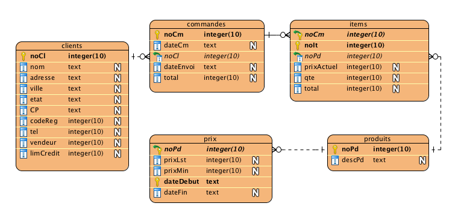

## Exercices

Pour ces exercices, vous utiliserez la bd
[commandes-sqlite](bds/commandes.sqlite.zip) créée précédemment.



### Ex 1

Les produits commandés en `1991` et pas en `1990`

Sur cette liste doit apparaître les attributs suivants : `noPd`

<details>
    <summary>Résultat anticipé</summary>  

```
noPd
----------
200380
```

</details>

<details>
    <summary>Réponse</summary>  

```sql
select distinct noPd
from items it
         inner join commandes cm on it.noCm = cm.noCm
where dateCm like '1991%'
  and noPd not in (select noPd
                   from items it
                            inner join commandes cm on it.noCm = cm.noCm
                   where dateCm like '1990%');
```

```sql
with commandes1990 as (select distinct noPd
                       from items it
                                inner join commandes cm on
                           cm.noCm = it.noCm
                       where dateCm >= '1990-01-01'
                         and dateCm < '1991-01-01')
select distinct noPd
from items it
         inner join commandes cm on it.noCm = cm.noCm
where dateCm >= '1991-01-01'
  and dateCm < '1992-01-01'
  and noPd not in commandes1990;
```

```sql
with commandes1990 as (select distinct noPd
                       from items it
                                inner join commandes cm on
                           cm.noCm = it.noCm
                       where dateCm >= '1990-01-01'
                         and dateCm < '1991-01-01')
select distinct it.noPd
from items it
         inner join commandes cm on it.noCm = cm.noCm
left join commandes1990 cm2 on it.noPd = cm2.noPd 
where dateCm >= '1991-01-01'
  and dateCm < '1992-01-01'
  and cm2.noPd is null;

```

</details>

### Ex 2

Les produits commandés et communs aux clients `103` et `104`.

Sur cette liste doit apparaître l'attribut suivant : noPd

<details>
    <summary>Résultat anticipé</summary>  

```
noPd
-----------
100861
102130
200376
```

</details>

<details>
    <summary>Réponse</summary>  

```sql
select noPd
from items it
         inner join commandes cm on it.noCm = cm.noCm
         inner join clients cl on cm.noCl = cl.noCl
where cm.noCl = 104
  and noPd in (select noPd
               from items it
                        inner join commandes cm on it.noCm = cm.noCm
                        inner join clients cl on cm.noCl = cl.noCl
               where cl.noCl = 103);
```

</details>

### Ex 3

Trouver l'avant-dernier prix de chaque produit en stock et présenter les
résultats selon l'ordre croissant des `pdno` pour les produits entre `100800` et
`100899`.

Sur cette liste doivent apparaître les attributs suivants : noPd, descPd,
prixLst

L'avant-dernier prix, c'est le dernier prix pour lequel `datefin` est non `null`
. En d'autres mots, le dernier prix, c'est celui pour lequel `datefin`
est `null`, on veut donc celui juste avant.

<details>
    <summary>Résultat anticipé</summary>  

```
noPd        descPd               prixLst
----------  -------------------  ----------
100860      ACE TENNIS RACKET I  32
100861      ACE TENNIS RACKET I  42
100870      ACE TENNIS BALLS-3   2.4
100871      ACE TENNIS BALLS-6   4.8
100890      ACE TENNIS NET       54
```

</details>

<details>
    <summary>Réponse</summary>  

2 solutions

```sql
select px.noPd, descPd, prixLst
from produits pd
         inner join prix px on pd.noPd = px.noPd
where px.noPd between 100800 and 100899
  and datefin = (select max(datefin)
                 from prix
                 where noPd = px.noPd)
order by px.noPd
```

```sql
select px.noPd, descPd, prixLst
from produits pd
         inner join prix px on pd.noPd = px.noPd
where px.noPd between 100800 and 100899
  and dateDebut = (select max(dateDebut)
                   from prix
                   where noPd = px.noPd
                     and dateFin is not null)
order by px.noPd;
```

</details>

### Ex 4

Trouver les clients qui n'ont pas de commandes en ordre croissant des noCl.

Vous devez produire 2 solutions :

4.1 : avec la clause `exists`

4.2 : avec la clause `in`

Sur cette liste doivent apparaître les attributs suivants : `noCl`, `nom`

<details>
    <summary>Résultat anticipé</summary>  

```
noCl        nom
----------  ----------
211         AT BAT
212         ALL SPORT
213         GOOD SPORT
214         AL PRO SHO
215         BOB FAMILY
216         THE ALL AM
217         HIT, THROW
218         THE OUTFIE
```

</details>

<details>
    <summary>Réponse</summary>  

solution 4.1 avec `exists`

```sql
select noCl, nom
from clients cl
where not exists(select *
                 from commandes cm
                 where cm.noCl = cl.noCl)
order by noCl;
```

solution 4.2 avec `in`

```sql
select noCl, nom
from clients
where noCl not in (select distinct noCl
                   from commandes)
order by noCl;
```

</details>

### Ex 5

Tous les clients de l'état `'MA'` avec la date de la dernière commande peu
importe si le client a des commandes, selon l'ordre croissant des numéros de
client

Sur cette liste doit apparaître les attributs suivants : `noCl`, `nom`, `dateCm`

En d'autres mots, première étape : il faut lister tous les clients de l'état
`'MA'`
et les trier en ordre de numéros. Deuxième étape : il faut aller chercher, pour
chaque client, la date de sa dernière commande. Si le client n'a pas de
commande, il faut le lister quand même.

<details>
    <summary>Résultat anticipé</summary>  

```
noCl        nom         dateCm
----------  ----------  ----------
202         HOOPS       19910802
207         FAST BREAK  19910420
211         AT BAT
216         THE ALL AM
223         VELO SPORT  19910425
227         THE TOUR    19910601
```

</details>

<details>
    <summary>Réponse</summary>  

```sql
select cl.noCl, nom, dateCm
from clients cl
         left outer join (select noCl, max(dateCm) as dateCm
                          from commandes
                          group by noCl) as cm1
                         on cl.noCl = cm1.noCl
where etat = 'MA'
order by cl.noCl;
```

</details>

### Ex 6

Trouver les clients qui ont commandé au moins un produit que le client `104` a
commandé pour l'année `1990`.

Sur cette liste doivent apparaître les attributs suivants : `noCl`, `nom`

<details>
    <summary>Résultat anticipé</summary>  

```
noCl        nom
----------  ----------
102         VOLLYRITE
105         K + T SPOR
106         SHAPE UP
107         WOMENS SPO
108         NORTH WOOD
```

</details>

<details>
    <summary>Réponse</summary>  

2 solutions

```sql
select distinct cl.noCl, nom
from (clients cl inner join commandes cm1 on cm1.noCl = cl.noCl)
         inner join items it on cm1.noCm = it.noCm
where it.noPd in (select distinct noPd
                  from items it
                           inner join commandes cm2 on cm2.noCm = it.noCm
                  where cm2.noCl = '104'
                    and cm2.noCl <> cm1.noCl
                    and dateCm like '1990%');
```

```sql
select noCl, nom
from clients
where noCl in (select noCl
               from commandes cm1
                        inner join items it on cm1.noCm = it.noCm
               where it.noPd in (select distinct noPd
                                 from items it
                                          inner join commandes cm2 on cm2.noCm = it.noCm
                                 where cm2.noCl = '104'
                                   and cm2.noCl <> cm1.noCl
                                   and dateCm like '1990%'));
```

</details>

### Ex 7

Trouver les clients de l'état 'CA' qui ont commandé plus que n'importe lequel
des clients de l'état de `'MN'`.

Sur cette liste doivent apparaître les attributs suivants : `noCl`, `nom`
, `somme`

<details>
    <summary>Aide</summary>  

Le select principal doit retourner le numéro de client, son nom et la somme du
`prixActuel * qte` des articles commandés (appelons ça "somme") pour ce client.

Ensuite vous devez filtrer ce résultat pour ne garder que ceux donc la somme est
plus grande que toutes les sommes pour tous les clients de l'état `MN`. (le max
des sommes)

</details>

<details>
    <summary>Résultat anticipé</summary>  

```
noCl        nom         somme
----------  ----------  ----------
102         VOLLYRITE   27348.0
104         EVERY MOUN  7160.8
105         K + T SPOR  46370.0
106         SHAPE UP    9076.8
```

</details>

<details>
    <summary>Réponse</summary>

2 solutions

```sql
select cl.noCl, nom, sum(prixActuel * qte) somme
from (clients cl inner join commandes cm on cm.noCl = cl.noCl)
         inner join items it on cm.noCm = it.noCm
where etat = 'CA'
group by cl.noCl, nom
having sum(qte * prixActuel) > (select max(prixqte)
                                from (select sum(prixActuel * qte) prixqte
                                      from (clients cl inner join commandes cm on cm.noCl = cl.noCl)
                                               inner join items it on cm.noCm = it.noCm
                                      where etat = 'MN'
                                      group by cl.noCl));
```

```sql
select cl1.noCl, nom, sum(prixActuel * qte) somme
from clients cl1
         inner join commandes cm on cm.noCl = cl1.noCl
         inner join items it on cm.noCm = it.noCm
where etat = 'CA'
  and exists(select sum(prixActuel * qte)
             from items it
                      inner join commandes cm on cm.noCm = it.noCm
                      inner join clients cl2 on cm.noCl = cl2.noCl
             where cl1.noCl = cl2.noCl
             group by cl2.noCl
             having sum(qte * prixActuel) >
                    (select max((select sum(prixActuel * qte)
                                 from items it
                                          inner join commandes cm on cm.noCm = it.noCm
                                          inner join clients cl on cm.noCl = cl.noCl
                                 where etat = 'MN'
                                 group by cl.noCl))))
group by cl1.noCl, nom;
```

</details>


