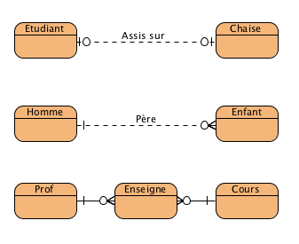

# Le modèle entité-association

Le **modèle entité-association** (le terme _entité-relation_ est une
traduction erronée largement répandue), ou **diagramme entité-association**
ou (en anglais _entity-relationship diagram_, abrégé en ERD), est un
modèle de données ou diagramme pour des descriptions de haut niveau de
modèles conceptuels de données. Il fournit une description graphique
pour représenter de tels modèles de données sous la forme de diagrammes
contenant des entités et des associations. De tels modèles sont utilisés
dans les phases amont de conception des systèmes informatiques.
([http://fr.wikipedia.org/wiki/ModC3%A8le_entit%C3%A9-association](http://fr.wikipedia.org/wiki/ModC3%A8le_entit%C3%A9-association))

**NOTE** : il existe plusieurs méthodes de représentation d'un DEA. Voir
[http://en.wikipedia.org/wiki/Entity%E2%80%93relationship_model](http://en.wikipedia.org/wiki/Entity%E2%80%93relationship_model) pour
quelques exemples.

Vous n'aurez pas à concevoir des DEA dans le cadre de ce cours. Vous
aurez seulement besoin d'être capable de les lire.

Diagrammes
----------

### Entités

Une **entité** est un objet, un événement, un lieu, une personne. Elle
doit être identifiable sans ambiguïté.

Exemple : le film « Avatar », l'acteur « Woody Allen »...

Une **classe d'entité** est un regroupement d'entités de même nature.

Exemple : les films, les acteurs.

Une entité est donc une valeur particulière d'une classe d'entité.

Dans un DEA, ce sont les classes d'entités qui sont représentées, mais
par convention, on parle d'entités.

### Associations 

Une **association** est un lien entre 2 ou plusieurs entités.

Exemple : Woody Allen **a joué dans** le film Woody et les robots

Notez qu'il y a souvent 2 façons de décrire la relation. On peut dire
qu'un acteur **a joué** dans un film, ou qu'un film **a** des acteurs.
Il arrive fréquemment qu'il soit difficile de mettre autre chose que
"a" d'un coté de la relation, mais qu'il soit facile de trouver un
verbe dans l'autre sens. On favorise le verbe plus expressif. Mais dans
certains cas, il est possible d'avoir un verbe des 2 sens: un étudiant
**est assis sur** une chaise,  et une chaise **supporte** un étudiant ;
ou encore un étudiant ~~**dort en écoutant**~~ **écoute** le professeur,
et le professeur** enseigne à** l'étudiant.

### Propriétés/Attributs 

Un **attribut** est une donnée élémentaire d'une entité.

Exemple : le nom, prénom, pour l'entité Acteur

Une relation peut aussi avoir des attributs.

Exemple : le rôle d'un acteur pour un film dans la relation « Joue ».

### Identifiants (clé primaire et étrangère) 

Il doit être possible d'identifier de façon unique chaque occurrence
d'une entité. Pour se faire, l'entité doit avoir une clé primaire (PK
= Primary Key) permettant de la distinguer des autres.

Cet identifiant peut être constitué d'une ou de plusieurs propriétés.
On privilégie l'identifiant le plus court et le plus naturel. Si aucune
propriété ne peut jouer ce rôle, on peut créer un identifiant artificiel
(un id).

Pour une association, l'identifiant est obtenu en juxtaposant les
identifiants des entités qui participent à la liaison.

Les attributs faisant partie de l'identifiant sont
soulignés ou en **gras** ou un symbole les
identifie (une clé, PK...).

Dans un DEA de niveau physique, lorsqu'une entité réfère à la clé
primaire d'une autre entité, cette référence est nommée la clé
étrangère (FK = Foreign Key)

### Cardinalité des associations 

Le rôle d'une association est défini par deux nombres : le nombre de
fois minimum et maximum qu'une entité participe à une association (min,
max).

Les valeurs possibles sont : (0,1), (1,1), (0,n), (1,n).

Il y a plusieurs techniques utilisées pour représenter cette
cardinalité. Nous utiliserons la technique « crow's foot » (pattes
d'oie, en référence à la forme du diagramme)

Lorsqu'on regarde la relation en entier, on regarde seulement le maximum
à chaque bout. On parle de relation 1 à 1 (1:1), 1 à plusieurs (1:M), ou
plusieurs à plusieurs (M:M)

Exemples :

Un étudiant est assis sur une chaise. Il ne peut y avoir 2 étudiants sur
1 chaise, et un étudiant ne peut être assis sur 2 chaises à la fois.
Mais un étudiant peut ne pas être sur une chaise, et une chaise peut
n'avoir personne d'assis sur elle. C'est donc une relation « 0 ou 1 »
aux deux extrémités de la relation, elle sera donc 1:1.

Un homme peut avoir des enfants. Il peut avoir 0 ou plusieurs enfants,
mais chaque enfant a assurément un père, en n'en a qu'un. C'est donc
une relation «0 ou n » du côté de l'homme, et « 1 et seulement 1 » du
côté enfant. C'est donc une relation 1:M.

Un professeur donne des cours. Il donne 0 ou plusieurs cours, et un
cours est donné par 0 ou plusieurs professeurs. C'est donc une relation
« 0 ou plusieurs » du côté du professeur, et la même chose du côté du
cours. La relation est donc M:M (plusieurs à plusieurs).

*Il est à noter qu'une telle relation devra être scindée en deux
relations 1:M dans le modèle physique. Les outils graphiques ne
permettront souvent pas d'avoir une M:M. Elle sera scindée
automatiquement selon les clés primaires des 2 entités.*

Démarche de conception 
----------------------

1.  Identifier les entités les plus naturelles (sujets, compléments)

2.  Identifier les associations entre ces entités (verbes)

3.  Identifier les attributs et les identifiants de ces entités et de
    ces associations (compléments de verbe)

4.  Exprimer les cardinalités et les rôles (distinguer le singulier du
    pluriel)

5.  Énumérer les contraintes.

